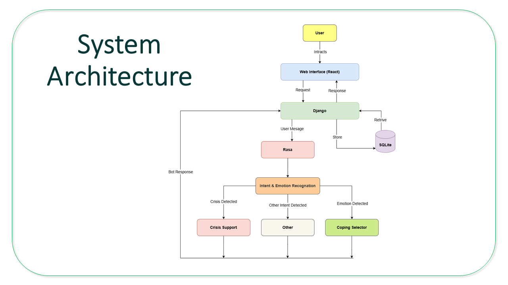
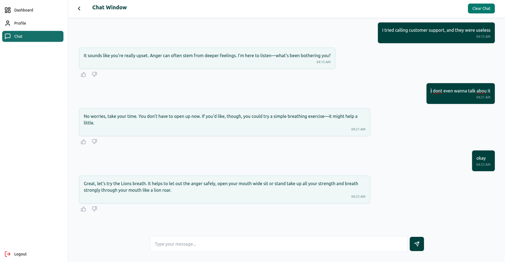

<p align="center">
  
</p>


<p align="center">
  
  
  
  
  
</p>

<br/>


The conversational AI engine behind MindCare — a mental wellness assistant that adapts to **who you are**, not just what you say. Every response is shaped by your emotional history, your preferences, and the patterns in how you've been feeling over time.

---

## 🗂️ Part of the MindCare System

MindCare is built across three integrated repositories:

| Repo | Role |
|------|------|
| [`frontend`](https://github.com/silura-008/frontend) | React UI — chat, dashboard, user pages |
| [`backend`](https://github.com/silura-008/backend) | Django REST API — data, auth, Rasa bridge |
| **`bot_parellel`** ← you are here | Rasa NLU + Core — the brain |

**Request flow:** React → Django REST API → Rasa

---

## 💡 What Makes This Different

Most mental wellness chatbots treat every user identically. MindCare doesn't.

Before any conversation starts, the Django backend sends the bot a personalised context package:
- The user's **personality type** — derived from their mood history over time
- Their **coping preferences** — the formats they've told us actually work for them
- Their **country** — so crisis helplines are always relevant, never generic

Everything that follows is filtered through those three lenses.

---

## 🧠 Core Capabilities

### Nuanced Emotion Detection

The NLU model is trained on natural, informal language — not clean textbook sentences. It catches emotion in the way people actually type.

| Input | Detected Intent |
|-------|----------------|
| `"i feel sad"` | 😔 Sad |
| `"I had a brother"` *(past tense — loss)* | 😔 Sad |
| `"I got a brother"` *(new sibling — joy)* | 😊 Happy |
| `"idk man just feels off today"` | 😰 Anxious |
| `"leave me alone"` | 😠 Angry |

Distinguishing *"I had a brother"* from *"I got a brother"* is a deliberate design benchmark — it represents the kind of contextual understanding that separates a real NLP model from keyword matching.

The model also separates **self-harm and violence intent** from general sadness or anger — a known failure point in off-the-shelf datasets, and the primary reason a custom dataset was built from scratch.

---

### 🎭 Personality-Based Responses

Users are classified into five profiles based on their **dominant emotional pattern over time**:

| Personality | Dominant Pattern | Response Approach |
|-------------|-----------------|-------------------|
| **Joy** | Predominantly happy | Light, warm, celebratory |
| **Sorrow** | Predominantly sad | Gentle, patient, persistent |
| **Fury** | Predominantly angry | Calm, grounding, de-escalating |
| **Nervous** | Predominantly anxious | Reassuring, structured |
| **New** | No history yet | Neutral, exploratory |

The same message, three different users:

> 💬 *"I feel sad"*

| Personality | Response |
|------------|----------|
| New | *"It sounds like you're feeling sad. I'm here for you — would you like to share more about what's going on?"* |
| Joy | *"You seem a bit down, which is okay — everyone has tough days. Do you feel like talking about it?"* |
| Sorrow | *"I can feel the heaviness in your words. It's okay to feel this way — talking might help lighten the load. What's on your mind?"* |

---

### 🤝 The Coax / Back-Off System

When a user declines a coping suggestion, the bot doesn't just drop it — but it doesn't push blindly either. The response depends on who it's talking to.

> 💬 User declines coping suggestion

| Personality | Bot Behaviour |
|------------|--------------|
| Joy / New | *"That's okay, no pressure. I'm here when you need me."* — backs off |
| Sorrow / Fury / Nervous | *"You don't have to take a big step — but completely refusing help might only make this heavier. You matter, and there is a way forward. Would you try a simple breathing exercise?"* — one gentle push |

If the user declines again → backs off regardless. No loops, no guilt trips.

This isn't just a conversational nicety — it's a deliberate behavioural design decision rooted in how people with persistent negative emotional patterns actually respond to unsolicited advice.

---

### 🌱 A Companion, Not Just a Crisis Tool

MindCare engages with **positive emotions too**. When a user shares something good, the bot celebrates with them, asks follow-up questions, and reinforces the moment.

Mental wellness is not only about managing distress — it's also about recognising and holding onto what's good.

---

### 🎛️ Personalised Coping Mechanisms

Users choose how they want to receive support:

| Preference | What They Get |
|-----------|--------------|
| 📖 Text-based | Articles, affirmations, journaling prompts |
| 🎬 Visual | Calming videos, guided imagery |
| 🎵 Audio | Music, breathing audio, podcasts |
| 🏃 Physical | Walking suggestions, stretching, breathing exercises |

The bot selects from a curated pool matched to both the **current emotion** and the **user's chosen format**. A user who prefers audio will never be handed a reading list.

---

### 👍 Feedback & Reinforcement Loop

After each response, users can like or dislike it and leave a comment. This isn't just a UX detail — the feedback is stored in the backend as the data foundation for a future reinforcement learning layer, where the model can be retrained on what users actually found helpful.

---

### 🆘 Crisis Intervention

When self-harm or violence intent is detected:
- The bot immediately shifts tone
- Strongly advises seeking professional help
- Provides the **country-specific helpline** fetched from Django at session start — never a generic number

---

## 🏗️ System Design

### Architecture 



---

## 📊 The Custom Dataset

Existing public datasets were rejected for three reasons:
- They grouped **self-harm** under general sadness — a dangerous misclassification in a wellness context
- They relied on clean, formal sentences that real users don't type
- They lacked the conversational variety needed for robust intent detection

The dataset was built entirely from scratch, prioritising:
- **Diverse phrasing** — formal, casual, shortened, slang, fragmented, informal
- **Augmentation** — synonym replacement, paraphrasing, structural variation
- **Edge cases** — ambiguous expressions, indirect emotion, mixed signals


**Evaluation results (100-sample held-out test set):**

| Metric | NLU Intent Classification | Core Response Selection |
|--------|--------------------------|------------------------|
| Precision | 93.2% | 92.5% |
| Recall | 92.8% | 91.8% |
| F1-Score | 93.0% | 92.1% |

---

## 🛠️ Tech Stack

| Component | Technology |
|-----------|-----------|
| Chatbot framework | Rasa 3.5.0 |
| NLU pipeline | BERT embeddings |
| Dialogue management | Rasa Core (stories + rules) |
| Custom actions | Python 3.9+ |

---

## 📁 Project Structure

```
bot_parellel/
├── data/
│   ├── nlu.yml          # Intent training examples (the custom dataset)
│   ├── stories.yml      # Conversation flow training
│   └── rules.yml        # Hard rules — crisis triggers, greetings
├── actions/
│   └── actions.py       # Coping logic, helpline lookup, personality handling
├── models/              # Trained Rasa models
├── tests/               # Test conversations
├── config.yml           # NLU pipeline config (BERT) + Core policies
├── domain.yml           # Intents, entities, slots, responses
└── endpoints.yml        # Action server config
```

---

## 🖼️ Screenshots

**Chat Window**


**Dashboard**


**Profile & Preferences**


---

## ⚙️ Local Setup

```bash
git clone https://github.com/silura-008/bot_parellel.git
cd bot_parellel
python -m venv venv
source venv/bin/activate        # Windows: venv\Scripts\activate
pip install rasa

# Train the model
rasa train

# Terminal 1 — Rasa server
rasa run --enable-api --cors "*"

# Terminal 2 — Action server
rasa run actions
```

Rasa runs at `http://localhost:5005`

> The Django backend must be running for session init and helpline data.  
> See [backend setup](https://github.com/silura-008/backend).

---

## 🔗 Related Repos

- [**Frontend**](https://github.com/silura-008/frontend) — React UI
- [**Backend**](https://github.com/silura-008/backend) — Django REST API
